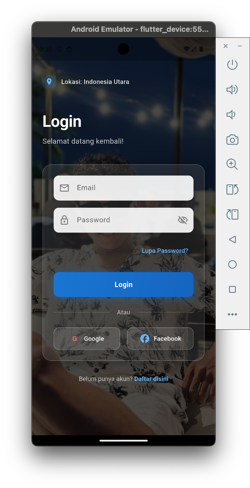

 

Elemen yang Teridentifikasi:

Header lokasi "Indonesia Utara"

Form input email dan password

Tombol "Lupa Password?"

Tombol login utama

Opsi login dengan Google dan Facebook

Link pendaftaran akun baru

(assets/images/izin lokasi.png)
📱 HALAMAN PERMINTAAN IZIN LOKASI(assets/images/izin lokasi.png)
Informasi Teknis
Package Geolocator: geolocator: ^11.0.0

Platform: Android Emulator

Waktu: 19:38

📱 HALAMAN REGISTRASI USER
Informasi Halaman
Fungsi: Pendaftaran akun baru

Lokasi: Indonesia Utara (pre-filled dari GPS)

Status: Form registrasi basic

📱 HALAMAN DASHBOARD UTAMA
Informasi Halaman
Fungsi: Menampilkan profil user dan rekomendasi bioskop berdasarkan lokasi

Waktu Akses: 19:48

Lokasi: Indonesia Utara

Status User: Member Aktif
